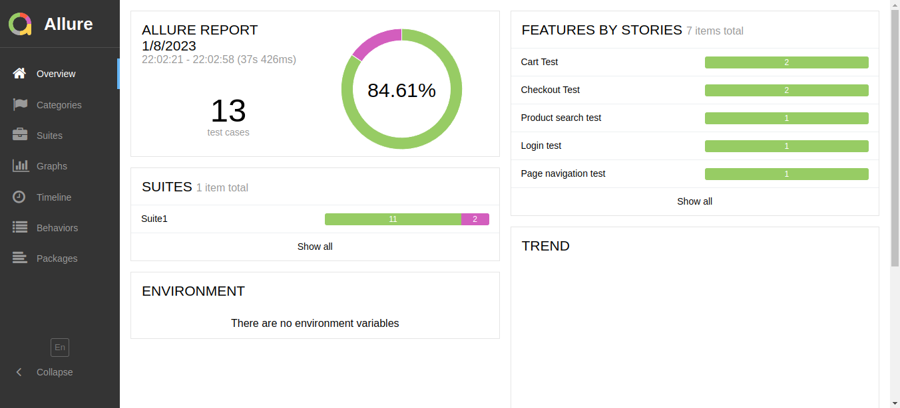

# Selenium Automation Framework

Selenium testing framework with reporting and automated testing with GitHub actions



# Run locally

Run test with chrome (default) browser

```bash
mvn clean test
```

Run tests with firefox browser

 ```bash
mvn clean test -Dbrowser=FIREFOX
```

Open [allure](https://docs.qameta.io/allure-report/#_installing_a_commandline) reports

```bash
allure serve target/allure-results
```

# Run on CI server

> Github actions is already setup to run on every push,
> check [actions tab](https://github.com/DNI9/SeleniumAutomationFramework/actions).

Pass the `CI` flag to run in headless mode

```bash
mvn -B clean test -DCI=true
```
